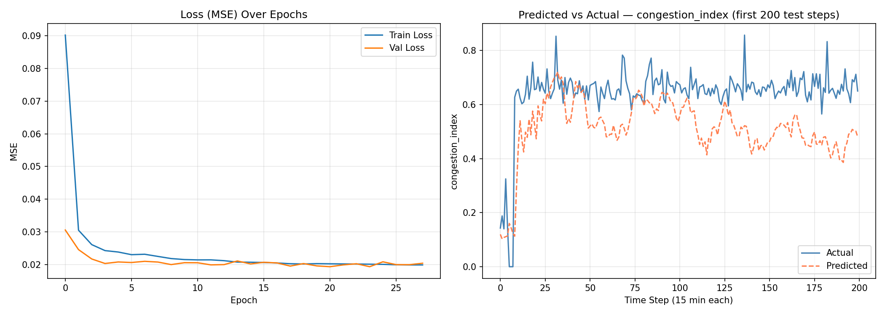

# UrbanAI

UrbanAI is a modern navigation and traffic forecasting application designed to optimize urban mobility, specifically tailored (but not limited to) regions like Mumbai. The platform seamlessly integrates advanced Machine Learning models to predict traffic congestion, estimate parking times, and recommend the best routes and departure times.

## 🚀 Tech Stack

### Frontend
- **React 18** & **Vite**: For building a fast, modern Single Page Application (SPA).
- **React Router**: For client-side routing and page transitions.
- **Recharts**: For dynamic data visualization.
- **Firebase**: For backend services like authentication and database storage.

### Backend
- **FastAPI** & **Uvicorn**: For a high-performance, asynchronous REST API.
- **Python (Pandas, NumPy)**: For robust data handling and manipulation.
- **Requests**: For integrating the Google Routes API.

### Machine Learning
- **TensorFlow & Keras**: For designing and training the core LSTM deep learning models.
- **Scikit-learn**: For data scaling (MinMaxScaler), metric calculation, and the parking estimation model.

---

## 🏗️ Architecture

The system follows a decoupled client-server architecture:

1. **Client (Frontend)**: 
   - Provides a modern UI with custom cursors, noise overlays, and scroll progress bars.
   - Contains major routes: Home, Features, How It Works, Dashboard, and Model Service.
   - Sends predictive requests containing origin, destination, and departure time to the API layer.
   
2. **Server (Backend API)**:
   - A FastAPI service that takes user inputs and first calls the **Route Junction Mapper** to convert origins and destinations into specific nodes (junctions) tracked in our dataset.
   - Retrieves real-time and historical sequences for these junctions to be fed into the models.
   - Compiles ML model outputs (congestion level, ETA, parking wait time, departure advice) into a consolidated response sent back to the client.

---

## 📸 Screenshots

*(Add UI screenshots of your project here)*

- **Dashboard**: https://vscode.dev/github/Shree8637/future-builders_ai_horizon26/blob/main/urbanai/backend/dashboard.png
- **Model Service page**: [urbanai\backend\model_service.png](https://vscode.dev/github/Shree8637/future-builders_ai_horizon26/blob/main/urbanai/backend/lstm_results.png)

### Model Results Visualization

The following plot illustrates the performance of the LSTM Traffic model, comparing predicted vs. actual congestion indices alongside training/validation loss curves.

---

## 🛠️ Data Pipelining

The foundation of UrbanAI's predictive capabilities is a comprehensive data pipeline:

1. **Data Source**: The primary dataset is `mumbai_traffic_lstm_ready.csv`.
2. **Feature Engineering**: 
   - **Temporal Encodings**: Cyclical features like hour of day, day of week, and month are encoded using sine and cosine transformations.
   - **Categorical Flags**: Indicators for weekends, holidays, peak hours, and school sessions.
   - **Environmental Data**: Weather codes, rainfall (mm), and visibility (km).
   - **Aggregated Lag & Rolling Features**: Historical vehicle counts, speed, congestion lags (1, 2, 4, 8 periods), and rolling standard deviations/means across different windows.
3. **Preprocessing**: 
   - Features and the target variable (`congestion_index`) are scaled down using `MinMaxScaler`.
   - Handled without random shuffling to prevent data leakage in a time-series context.
4. **Temporal Split**: The dataset is divided strictly by chronological time: 70% for Training, 15% for Validation, and 15% for Testing.
5. **Sequence Generation**: The data is partitioned into sliding windows (sequences) of 16 intervals (15 minutes each, equating to 4-hour blocks) that serve as input to predict the subsequent interval.

---

## 🤖 Machine Learning Models

### 1. LSTM Traffic Forecasting Model
- **File**: `backend/lstm_traffic_model.keras`
- **Purpose**: To predict the future `congestion_index` for a given junction up to 15 minutes in advance using sequence modeling.
- **Architecture**: A multi-layer Long Short-Term Memory (LSTM) network with 64 units, Batch Normalization, and Dropout (20%) to prevent overfitting, topped with Dense layers.
- **Evaluation Metrics (on Test Set)**: 
  - **MAE** (Mean Absolute Error): Captures the absolute average deviation.
  - **RMSE** (Root Mean Squared Error): Penalizes larger errors more heavily.
  - **MAPE** (Mean Absolute Percentage Error): Shows the accuracy as a relative percentage.

### 2. Parking Wait Time Estimator
- **File**: `backend/parking_model.pkl`
- **Purpose**: Estimates the number of minutes it will take to find a parking spot based on the local traffic congestion level.
- **Architecture**: Scikit-Learn based machine learning model that maps scalar traffic constraints to time delays.

### 3. Route to Junction Mapper
- **File**: `backend/route_junction_mapper.py`
- **Purpose**: Interfaces with the Google Routes API to correlate user-friendly string addresses (Origin & Destination) geographically with known dataset junction IDs used for precise array-indexing into the ML pipeline.
